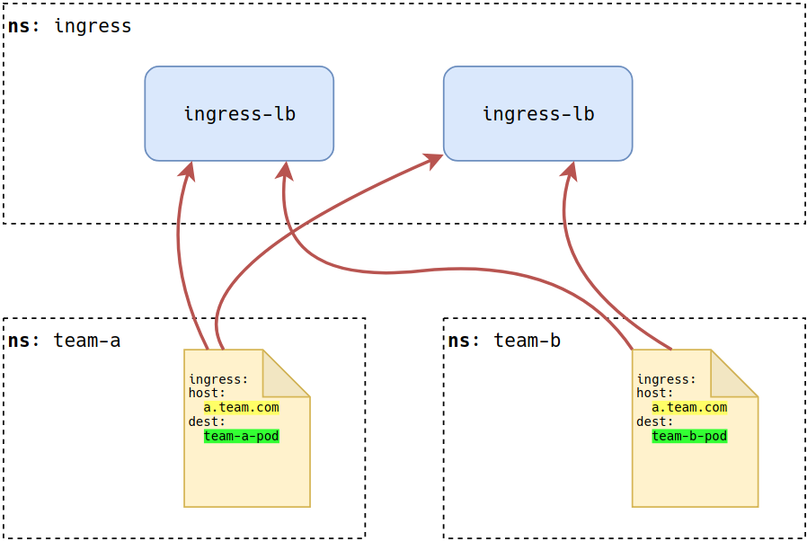

# Contour: Advanced Ingress and Delegation

Contour is an ingress controller that configures Envoy based on Ingress and IngressRoute objects in a Kubernetes cluster. This post covers how contour supports advanced ingress functionality with its [IngressRoute](https://github.com/heptio/contour/blob/master/docs/ingressroute.md) Custom Resource Definition (CRD). We'll explore some common ingress needs such as weighted load balancing and cover how multi-team ingress can be facilitated.

## How contour Works

First, let's examine how Contour works,

## Route Delegation

Clusters supporting multiple teams have unique ingress challenges. Like many parts of Kubernetes, once a cluster is in use by more than one team, handling the multi-tenant needs or isolation becomes challenging. In Kubernetes, we often scope team's resources by namespace. Additonally, many clusters are setup to offer a shared-ingress layer. Meaning a set of load balancers and controller run inside the cluster offering layer 7 routing to different team's workloads. Consider the following running in a cluster.

Notice the `host` value highlighted in yellow in the `team-a` and `team-b` namespaces. Both attempt to define routing rules for the host `a.team.com`. Each set a different destination (dest), team-a-pod and team-b-pod respectivly. This raises interesting questions: 

* Will the load balancer act deterministically and just choose 1 destination to route to? 
* If so, which destination will win? 
* Why was `team-b` able to request `a.team.com`? 
* How can we reserve such such domains to only `team-a`?

There are a multitude of ways to solve this. One is to implement a [ValidatingWebhook](https://github.com/stevesloka/validatingwebhook) admission controller capable of ensuring teams only request their "owned" domains. Another is to rely on delegation of the ingress controller itself. This is where Contour shines. By implementing an administrative ingress namespace, we can create delegation rules for the ingress rules requested by other teams / namespaces. Consider the following, revised, model.